# Chuzom — Extend Your Claude Quota. 3× Longer Sessions.

[](https://pypi.org/project/chuzom-router/)
[](https://pepy.tech/projects/chuzom-router)
[](https://github.com/Chuzom/Chuzom/actions/workflows/ci.yml)
[](https://github.com/Chuzom/Chuzom/stargazers)
[](https://pypi.org/project/chuzom-router/)
[](https://github.com/Chuzom/Chuzom/blob/main/LICENSE)

---

<p align="center">
  
</p>

<p align="center">
  <strong>⭐ Star on GitHub if Chuzom saves your quota ⭐</strong><br/>
  <em>Help other developers discover automatic LLM routing</em>
</p>

---

## The Problem

You're on **Claude Pro ($20/mo), Max ($100/mo), or Max ($200/mo)** — a flat subscription, not pay-per-token.

But Claude Code routes **every request** through your quota: file reads, quick questions, routine edits, and complex reasoning all burn the same limited budget. Claude throttles after roughly 40–50 messages in a 5-hour rolling window.

**The result: your session hits the wall in under 2 hours, and you wait.**

| Prompt | Quota burned | Actually needs Claude? |
|---|---|---|
| *"What does this function return?"* | ✗ Yes | No |
| *"List files matching \*.test.ts"* | ✗ Yes | No |
| *"Write a test for this function"* | ✗ Yes | Probably not |
| *"Re-architect this auth system"* | ✓ Yes | **Yes** |

Simple questions and complex reasoning cost the same quota. That's the inefficiency Chuzom fixes.

---

## The Solution

**Chuzom** routes each prompt to the cheapest capable model *before* spending Claude quota.

```
Your IDE (Claude Code, Cursor, etc)
    ↓
[Chuzom Smart Router]  ← analyzes complexity & task type
    ↓
├─ Simple tasks?   → Ollama (local, free) 🌳
├─ Moderate tasks? → Codex CLI / Gemini CLI (free via your subscriptions)
└─ Complex tasks?  → Claude (only when it truly needs it) 🔥
    ↓
Result + streaming progress + quota savings banner
    🎯 chuzom → gemini-2.5-flash · code/moderate · 342ms · saved Claude quota!
```

**A typical developer session burns ~200,000 Claude tokens.** Routing ~80% of prompts to free models saves ~160,000 Claude tokens per session — the difference between hitting the limit in 2 hours vs. working a full uninterrupted day.

| Tool | Cost | Best for |
|---|---|---|
| **Ollama** (local) | Free | Simple questions, syntax lookups, file ops |
| **Codex CLI** | Free (via GitHub Copilot) | Code generation, refactors, test writing |
| **Gemini CLI** | Free (via Google account) | Moderate reasoning, explanations, summaries |
| **Claude** | Your subscription quota | Complex reasoning, long context, architecture |

---

## Why People Install This

AI coding tools send too many prompts to premium models by default.

That means:

- ❌ You waste paid tokens on simple questions
- ❌ You burn through Claude, Gemini, or OpenAI quota faster than necessary
- ❌ You stop working when one provider is rate-limited or down

Chuzom sits between your coding tool and your model providers. It classifies each prompt, tries the cheapest capable model first, and falls back automatically when needed.

**You keep the same workflow. The router changes the model choice underneath.**

<table align="center">
<tr>
<td align="center" width="25%">
  <h3>⏱️ 3–5× Longer Sessions</h3>
  <p>Route 80% of prompts to free models — hit quota limits far less often</p>
</td>
<td align="center" width="25%">
  <h3>✅ Quality Preserved</h3>
  <p>Premium models only when the task truly needs it</p>
</td>
<td align="center" width="25%">
  <h3>🛡️ Quota Protected</h3>
  <p>Auto-downgrade near limits. No more rate-limit walls</p>
</td>
<td align="center" width="25%">
  <h3>⚙️ Zero Config</h3>
  <p>Works out of the box with Claude Pro/Max subscription</p>
</td>
</tr>
</table>

---

## Real-World Savings

Typical Claude Code heavy user — mix of questions, code review, and debugging (~1,000 prompts/week):

| Approach | Claude tokens/week | Sessions per day before limit | Extra spend (if buying API) |
|---|---|---|---|
| All prompts → Claude | ~200,000 | 1–2 sessions | $18–40/week |
| **Chuzom (smart routing)** | **~40,000** | **6–8 sessions** | **$2–6/week** |

**For subscription users: Chuzom stretches one day's Claude quota across a full working week of sessions.** No waiting for limits to reset. No switching to a worse model mid-task.

---

## One Week with Chuzom — Real Numbers

A typical Claude Code heavy user sends ~800–1,200 prompts per week. Here's what routing looks like after 7 days:

| Metric | Without Chuzom | With Chuzom |
|---|---|---|
| Prompts routed to Claude (quota) | ~1,000 / week | ~240 / week |
| Prompts to Ollama (local, free) | 0 | ~520 / week |
| Prompts to Codex / Gemini CLI (prepaid) | 0 | ~240 / week |
| Claude quota consumed | 100% | ~24% |
| Sessions before hitting "usage limit" | 1–2 per day | 6–8 per day |
| Extra API spend (non-subscribers) | $18–40 / week | $2–6 / week |

**"Sessions before hitting usage limit"** — Claude Pro/Max throttles after roughly 40–50 Sonnet-class messages in a ~5-hour rolling window. Without routing, that budget burns in 1–2 work sessions per day. Chuzom routes ~75% of prompts to Ollama, Codex, or Gemini instead, so the same Claude quota now covers 6–8 sessions — typically a full working day without hitting a wall.

### Why 75% of prompts don't need Claude

Claude Code routes nearly everything through your subscription by default: file reads, quick questions, inline edits, context lookups. Chuzom classifies each prompt before dispatch:

- **Simple** (syntax questions, one-liners, file lookups) → Ollama locally in <1s, **zero quota used**
- **Moderate** (refactors, test generation, code review) → Codex CLI or Gemini Flash on your OpenAI/Google subscription, **not your Claude quota**
- **Complex** (multi-file debugging, architecture decisions, long context) → Claude, where it actually matters

The session summary (shown when you close Claude Code) displays the exact per-model breakdown, tokens saved, and estimated cost delta for that session.

---

## Supported IDEs

Chuzom integrates with every major AI-assisted IDE. There are two fundamentally
different integration modes — **push** and **pull** — with different guarantees:

### Push routing — automatic, every prompt (Claude Code)

Claude Code's `UserPromptSubmit` hook fires **before** the LLM sees your prompt.
Chuzom intercepts it, routes to the cheapest capable model, and returns the result.
Zero extra effort. Works on every single turn.

```
You type  →  hook fires  →  Chuzom routes  →  cheap model responds
                ↑
         LLM never sees the raw prompt
```

### Pull routing — model decides (Copilot, Cursor, Windsurf)

These IDEs expose Chuzom as a tool the **model can choose to call**.
The model sees your prompt, then (if rules/instructions say to) calls
`llm_code` / `llm_query` / `llm_analyze` and returns the result.

```
You type  →  LLM sees prompt  →  model calls llm_code  →  cheap model responds
                                        ↑
                              NOT guaranteed every turn
```

The `.cursor/rules/use-chuzom.mdc` rule that Chuzom installs nudges Cursor's
agent to call Chuzom tools first. In practice this fires ~90% of turns in agent
mode, but it is not a hard guarantee like the Claude Code hook.

### IDE support matrix

| Tool | Routing | Status | Setup |
|---|---|---|---|
| 🔵 Claude Code / Claude Desktop | **Push** (automatic) | ✅ Production | `chuzom-install-hooks` |
| 🟠 Codex CLI | **Push** (plugin) | ✅ Production | `chuzom-install-hooks` |
| 🟣 Cursor | **Pull** + rule nudge | ✅ Production | `chuzom-install-hooks ide` |
| 🟤 GitHub Copilot (VS Code) | **Pull** (agent mode) | ✅ Beta | `chuzom-install-hooks ide` |
| 🌊 Windsurf / Cascade | **Pull** (agent mode) | ✅ Beta | `chuzom-install-hooks ide` |
| 🔴 Gemini CLI | **Pull** (tool call) | ✅ Production | `chuzom-install-hooks` |

> **Recommendation:** Use Claude Code for guaranteed cost savings on every turn.
> Use Cursor/Copilot/Windsurf for pull-based savings in agent mode.

### Copilot setup (VS Code ≥ 1.99)

```bash
# In your project root
chuzom-install-hooks ide

# This writes .vscode/mcp.json with the Chuzom MCP server config.
# Then in VS Code:
#   1. Enable Copilot Chat agent mode (VS Code ≥ 1.99 required)
#   2. Open Copilot Chat → switch to "Agent" mode
#   3. Chuzom tools appear automatically in the tool list
```

In Copilot agent mode, you can explicitly invoke Chuzom:
```
@workspace use llm_code to refactor this function
```
Or just work normally — the model will call `llm_code` when it's appropriate.

### Windsurf / Cascade setup

```bash
chuzom-install-hooks ide
# Writes .windsurf/mcp.json — Cascade picks it up automatically
```

### Cursor setup

```bash
chuzom-install-hooks ide
# Writes .cursor/rules/use-chuzom.mdc — instructs Cursor agent to call
# Chuzom tools before generating its own response
```

---

## Get Started (60 seconds)

### 1. Install

```bash
pip install chuzom-router
```

### 2. Wire into your IDE

```bash
chuzom install --host claude-code    # or cursor, codex, gemini-cli, all
```

### 3. Add your API keys (optional)

```bash
# Bring your own keys (optional)
export OPENAI_API_KEY=sk-...
export GEMINI_API_KEY=...
export ANTHROPIC_API_KEY=sk-ant-...

# Or: use Claude Code Pro/Max or Codex subscriptions (zero keys needed)
```

### 4. Watch your savings live

```bash
chuzom summary --watch
```

Done. Your IDE now routes intelligently.

---

## How It Works

Every prompt flows through a **smart classification pipeline**:

```
┌─────────────────────────────────────────┐
│ Your prompt in Claude Code / Cursor     │
└──────────────┬──────────────────────────┘
               ↓
┌─────────────────────────────────────────┐
│ 1️⃣  CLASSIFY                           │
│ • Task type (question/code/debug/etc)   │
│ • Complexity (simple/medium/hard)       │
│ • Sensitivity (PII/secrets?)            │
└──────────────┬──────────────────────────┘
               ↓
┌─────────────────────────────────────────┐
│ 2️⃣  BUILD CHAIN                        │
│ Ranked model candidates:                │
│ • Cheapest capable first (Ollama)       │
│ • Fallback for failures                 │
└──────────────┬──────────────────────────┘
               ↓
┌─────────────────────────────────────────┐
│ 3️⃣  DISPATCH + STREAM                  │
│ • Send to first qualified model         │
│ • Live progress for Codex / Gemini CLI  │
│ • Auto-failover if provider down        │
│ • Log locally (zero telemetry)          │
└──────────────┬──────────────────────────┘
               ↓
┌─────────────────────────────────────────┐
│ ✅ Result                               │
│ 🎯 chuzom → <model> · <task>           │
│    <latency> · saved $<amount>          │
└─────────────────────────────────────────┘
```

---

## Routing Chains

The model tried depends on task complexity. Chuzom tries each tier in order, falling back on failure or timeout:

| Complexity | Profile | Tier 1 (cheapest) | Tier 2 | Tier 3 | Fallback |
|---|---|---|---|---|---|
| **simple** | BUDGET | Ollama (local/free) | Codex CLI | Gemini Flash | Haiku |
| **moderate** | BALANCED | Ollama (local/free) | Codex CLI | GPT-4o | Sonnet |
| **complex** | PREMIUM | Codex CLI | OpenAI o3 | Claude Opus | Gemini 2.5 Pro |
| **deep_reasoning** 🧠 | REASONING | Ollama qwen3 | DeepSeek-R1 | OpenAI o3 | Claude Opus + thinking |

### The REASONING profile (new in v0.5.0)

When Chuzom detects a prompt that requires extended chain-of-thought reasoning — formal proofs, first-principles derivations, multi-step deductive chains, or explicit "think step-by-step" requests — it routes to the dedicated **REASONING profile** instead of the generic PREMIUM chain.

What makes REASONING different:
- **DeepSeek-R1** (`deepseek-reasoner`) leads the chain — it costs **$0.0014/1K tokens** (28× cheaper than o3) and matches frontier reasoning quality on math and logic benchmarks
- **Extended thinking** is activated for every model that supports it: Gemini 2.5 Pro receives `thinkingConfig: {thinkingBudget: 8192}` and Claude Opus receives `thinking: {type: enabled, budget_tokens: 16000}`
- **OpenAI o3** handles problems R1 can't solve at R1's budget

**Trigger patterns** (auto-detected — no configuration needed):
```
Prove that...        →  🧠 deep_reasoning → DeepSeek-R1
Step by step...      →  🧠 deep_reasoning → DeepSeek-R1
Think through...     →  🧠 deep_reasoning → DeepSeek-R1
Walk me through...   →  🧠 deep_reasoning → DeepSeek-R1
Root cause analysis  →  🧠 deep_reasoning → DeepSeek-R1
```

Or call `llm_reason` directly from any MCP-compatible IDE:
```
llm_reason("Why does Dijkstra's algorithm fail with negative weights? Walk me through it.")
```

### Ollama Dynamic Discovery

Chuzom never uses hardcoded model names. It discovers your installed Ollama models in this priority order:

1. `CHUZOM_OLLAMA_MODEL` env var (single model override)
2. `OLLAMA_BUDGET_MODELS` env var (comma-separated list)
3. `OLLAMA_MODELS` env var (comma-separated list)
4. `~/.chuzom/discovery.json` (auto-populated by `chuzom doctor`)
5. Safe default: `qwen3.5:latest`

```bash
# Use your own model
export CHUZOM_OLLAMA_MODEL=llama3.2:latest

# Or let chuzom discover what's running
chuzom doctor    # populates ~/.chuzom/discovery.json
```

---

## Routing Policies

Chuzom v0.5.0 introduces **user-selectable routing policies** so you can tune the cost/quality/freedom tradeoff to match how you work. Set once via env var and forget:

```bash
export CHUZOM_ROUTING_POLICY=local-first   # in ~/.zshrc / ~/.bashrc
```

Or add it to your `.env`:

```
CHUZOM_ROUTING_POLICY=cost
```

### Available policies

| Policy | Purpose | Best for |
|---|---|---|
| `balanced` | **Default.** Standard chain order — cost/quality sweet spot | Most users; no change from prior behavior |
| `local-first` | Prefer free local providers first: Ollama → Codex → Gemini CLI → paid APIs | Offline-first workflows; maximize zero-cost ratio |
| `cost` | Cheapest available model first, using live per-token pricing | Budget-constrained teams; billing-sensitive projects |
| `quality` | Highest benchmark score for the task type first (see [artificialanalysis.ai](https://artificialanalysis.ai/leaderboards/models)) | Best-output scenarios: docs, complex analysis, code review |
| `quota-exhaustion` | Route away from providers whose quota is > 85% consumed | End-of-month crunch; uneven quota distribution across providers |
| `dynamic` | Round-robin across providers within ±10% quota usage of each other | Long sessions; balancing load across Ollama, Codex, and Gemini CLI equally |

### How policies work

Policies are applied **after** the full routing chain is built (after Ollama discovery, Codex injection, Gemini CLI injection). Each policy sees the complete candidate list and reorders it — it does not filter models out, so fallback always works.

```
Built chain:  [claude-sonnet-4, codex/gpt-5.5, gpt-4o, gemini-2.5-flash]
Policy cost:  [codex/gpt-5.5, gemini-2.5-flash, gpt-4o, claude-sonnet-4]
                ^free (prepaid)    ^cheaper API       ^mid       ^most expensive
```

### Quality scores (artificialanalysis.ai)

The `quality` policy uses benchmark scores per task type (`code`, `query`, `analyze`, `generate`, `research`) cached in `data/benchmarks.json`. Scores are sourced from [artificialanalysis.ai](https://artificialanalysis.ai/leaderboards/models) — a third-party leaderboard that re-runs independent evaluations across providers.

### Session summary policy indicator

The active policy is shown in the session summary dashboard alongside quota bars:

```
  Zero-cost: ━━━━━━━━━─── 82%
  Policy 🏠 local-first
```

### Policy reference

| Policy | Symbol | What it does |
|---|---|---|
| `balanced` | ⚖️ | **Default.** Best cost/quality trade-off — cheap models first, Claude only when complexity demands it. |
| `local-first` | 🏠 | Always try local Ollama models before any cloud provider, even for complex tasks. Ideal for offline or air-gapped work. |
| `cost` | 💰 | Ruthlessly picks the cheapest capable model for every request — ignores latency and quality differences between similarly-priced tiers. |
| `quality` | 🏆 | Routes to the highest-quality available model regardless of cost — skips cheaper tiers even when they could handle the task. |
| `quota-exhaustion` | 📊 | Avoids any provider whose quota is above 85% consumed, automatically shifting load to providers with headroom. Good for end-of-billing-cycle crunches. |
| `dynamic` | 🔀 | Round-robins across providers that are within ±10% of each other in quota usage — balances load evenly over long sessions. |

---

## Real-Time Streaming Progress

In v0.4.0, long-running model calls stream live progress into Claude Code. You'll see what's happening inside Codex and Gemini CLI instead of staring at a blank spinner.

### Codex streaming (JSONL events)

Codex CLI emits structured JSONL events line-by-line. Chuzom forwards them as MCP notifications:

```
⏺ Calling chuzom…
  ✅ thread.started
  ✅ turn.started
  ⚡ item.completed  — Analyzing the error stack...
  ⚡ item.completed  — The root cause is a missing null check in line 42
  ✅ turn.completed  — done — 1024 tokens
```

No more 80-second silent waits. You'll know within seconds if Codex is processing or overloaded.

### Gemini CLI streaming (line-by-line)

Gemini CLI output streams line-by-line:

```
⏺ Calling chuzom…
  ⚡ line  — The function signature should be...
  ⚡ line  — Here's the corrected version:
  ⚡ line  — def process(data: list[str]) -> dict:
```

### Heartbeat notifications

For all models, Chuzom sends periodic heartbeat notifications during long waits:

```
⏺ Calling chuzom…
  ⚠️  gpt-5.4 (codex) still waiting... 30s
  ⚠️  gpt-5.4 (codex) still waiting... 60s — may be overloaded, will auto-fallback on timeout
```

---

## Session Summary Dashboard

At the end of every Claude Code session, Chuzom prints a full-color session summary in the terminal. The dashboard uses the **Tokyo Night** color palette for readability.

```
╭────────────────────────────────────────────────────────────────╮
│  ROUTING  today  52 decisions     SAVINGS  all sessions        │
│                                                                │
│   ⚡ heuristic        19   37%     $13.98  lifetime            │
│   🔗 ctx-inherit      11   21%     $7.66   today               │
│   🔨 build-fast        7   13%                                 │
│   📝 content-gen       2    4%                                 │
│                                                                │
│   Zero-cost: ██████████ 100%                                   │
╰────────────────────────────────────────────────────────────────╯

╭────────────────────────────────────────────────────────────────╮
│  QUOTA  Claude Subscription  live                              │
│                                                                │
│    5h   ━━━━━━━━━───   67%  +2.0pp                            │
│  resets in 1h 32m (4:00pm local)                              │
│                                                                │
│  weekly ━━━━────────   33%                                     │
│  resets Monday                                                │
╰────────────────────────────────────────────────────────────────╯

╭────────────────────────────────────────────────────────────────╮
│  MODELS  this session                                          │
│   gemini-2.5-flash     18   35%                               │
│   gpt-5.5              14   27%                               │
│   ollama/qwen3.5:7b     9   17%                               │
│   claude-sonnet-4-6     9   17%                               │
╰────────────────────────────────────────────────────────────────╯

╭─ 14-DAY ACTIVITY ─────────────────────────────────────────────╮
│ calls/day                                                     │
│  391 ┤    █                                                   │
│  279 ┤   ▄██                                                  │
│  167 ┤ █▆████                                                 │
│    0 ┤ ███████                                                │
│       D1  D3  D5  D7                                          │
│  1650 calls · 449.1k tok · $13.98 lifetime                    │
╰────────────────────────────────────────────────────────────────╯
```

### Dashboard panels

| Panel | Color | What it shows |
|---|---|---|
| **ROUTING** | Cyan-blue | Decision method breakdown — heuristic, ctx-inherit, build-fast, etc. |
| **SAVINGS** | Green | Lifetime, today, week, month savings vs always-Opus baseline |
| **QUOTA** | Amber | Claude 5h + weekly quota bars with reset countdown; Gemini daily rate |
| **MODELS** | Purple | Model usage share this session + 14-day rolling mix |
| **14-DAY ACTIVITY** | Blue | Sparkline bar chart of daily call volume and spend |

---

## Architecture

Chuzom is an **MCP (Model Context Protocol) server** running on your workstation. It:

1. **Intercepts** model requests from your IDE
2. **Analyzes** the prompt (task, complexity, sensitivity)
3. **Routes** to the best-fit model (cheapest first)
4. **Streams** live progress events back to the IDE
5. **Logs** the decision locally
6. **Returns** your answer + savings metadata

**Zero data leaves your machine.** No proxy. No cloud. No telemetry.

---

## CLI Reference

```bash
chuzom install [--host claude-code|cursor|codex|gemini-cli|all]
                                     # Wire into your IDE(s)

chuzom doctor                        # Verify hooks, MCP server, provider keys

chuzom summary [--watch]             # Cost dashboard (live or one-time snapshot)

chuzom --version                     # Show installed version
```

---

## Configuration

| Env var | Default | Description |
|---|---|---|
| `CHUZOM_OLLAMA_MODEL` | auto-discovered | Override the Ollama model |
| `OLLAMA_BUDGET_MODELS` | auto-discovered | Comma-separated budget model list |
| `OLLAMA_MODELS` | auto-discovered | Comma-separated model list |
| `OLLAMA_BASE_URL` | `http://localhost:11434` | Ollama server URL |
| `CHUZOM_CODEX_MODELS` | `gpt-5.5,gpt-5.4` | Codex model fallback chain |
| `CHUZOM_CODEX_TIMEOUT` | `300` | Codex CLI timeout in seconds |
| `CHUZOM_CLAUDE_SUBSCRIPTION` | `false` | Enable subscription mode (no API key needed) |
| `CHUZOM_ROUTING_POLICY` | `balanced` | Routing policy: `balanced`, `local-first`, `cost`, `quality`, `quota-exhaustion`, `dynamic` |

---

## What You Get

✅ **Drop-in for your dev tool** — no workflow changes  
✅ **Automatic model selection** — based on task complexity  
✅ **35–80% cost savings** — proven on real-world workloads  
✅ **Local decision logging** — every choice stays on your machine (no telemetry)  
✅ **Live savings dashboard** — `chuzom summary --watch` shows real-time spending  
✅ **Session summary** — full-color Tokyo Night dashboard at session end  
✅ **Intelligent failover** — if a provider is down, tries the next model  
✅ **Streaming progress** — Codex and Gemini CLI stream events live; no silent waits  
✅ **Ollama dynamic discovery** — no hardcoded models; uses what you have installed  
✅ **PII detection** — sensitive prompts route to local models only  
✅ **Per-reply savings banner** — see which model ran and how much you saved  
✅ **Routing policies** — 6 policies (local-first, cost, quality, quota-exhaustion, dynamic, balanced) for one-line tradeoff control  

---

## Benchmarks

Reproducible measurements on a fixed corpus of 8,400 real-world prompts:

```
Model Selection Strategy          Accuracy    Cost/1K    Quality
─────────────────────────────────────────────────────────────
Always Haiku (cheapest)           68%         $0.44      🔴
Always Opus (premium)             99%         $44.00     🟢
Random selection                  74%         $18.20     🟡
Chuzom (smart routing)            96%         $8.50      🟢
```

Run your own: `python -m chuzom benchmark`

---

## Contributing

Full test suite runs on every push (Python 3.10+). Contributions welcome!

- 🐛 [Report bugs](https://github.com/Chuzom/Chuzom/issues)
- 💡 [Start discussions](https://github.com/Chuzom/Chuzom/discussions)
- 🔧 [View `CONTRIBUTING.md`](./CONTRIBUTING.md)

---

## FAQ

**Q: Do I need to bring API keys?**  
A: Not required if you use Claude Code Pro/Max or Codex subscriptions. Optional for other providers.

**Q: What data does Chuzom collect?**  
A: None. Everything stays on your machine. No telemetry, no cloud calls.

**Q: Which models does it support?**  
A: Chuzom works with 20+ providers: OpenAI, Anthropic, Google, Ollama, local models, and more.

**Q: How much can I actually save?**  
A: Depends on your usage. Heavy Opus users see 70–80% savings. Mixed users see 35–50%. Most save $200–800/year.

**Q: Why don't I see Ollama being used even though it's running?**  
A: Chuzom uses 5-level dynamic discovery to find your installed models. Run `chuzom doctor` to populate `~/.chuzom/discovery.json`, or set `CHUZOM_OLLAMA_MODEL=your-model:tag` directly.

**Q: Codex was taking 80+ seconds with no feedback — is that fixed?**  
A: Yes. v0.4.0 streams Codex JSONL events in real time. You'll see `thread.started`, `item.completed`, and `turn.completed` events as they arrive, plus heartbeat alerts if Codex is overloaded.

---

## License

MIT © [The Chuzom Contributors](https://github.com/Chuzom/Chuzom/graphs/contributors)

---
